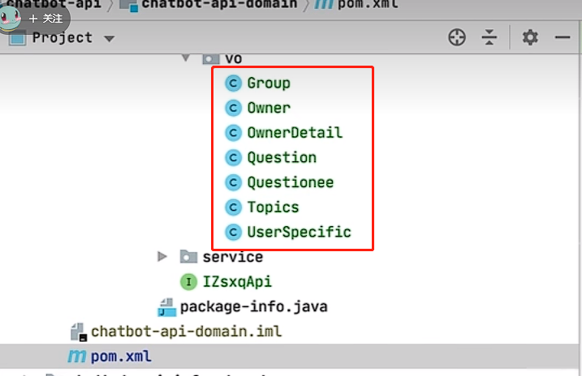
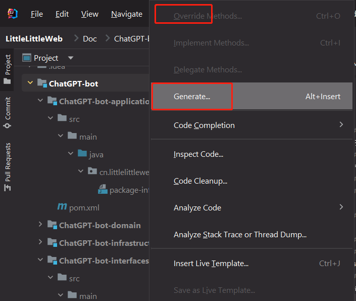

# 服务/API开发知识
- [相关JAVA知识](#相关JAVA知识)
  - JAVA对象结构
  - 枚举(eEnum)
  - 接口(interface)
  - 实现(implements)
  - 异常处理(Exception)
  - 枚举(eEnum)
- [工具](#工具)
  - 将JSON转换为java对象
  - IDEA的快捷代码生成

本节主要学习他的代码结构、相关java知识、工具的使用即可，详细的包和依赖的使用不需要了解太清楚，也不需要记住，因为不一定使用知识星球

## 相关JAVA知识
下列知识在开发API/服务时会用到
### JAVA对象结构
如本节中的这堆对象，都是可以从json转换的，并且和json一一对应

### 枚举(eEnum)
本节中的返回状态码status即为枚举
### 接口(interface)
### 实现(implements)
### 异常处理(Exception)
不想处理的可以直接抛出(throw)，需要处理的可以使用  
```
try{
}
catch(Exception exception){
}
```

### 创建分支

## 工具
### 将JSON转换为java对象
json2entity：https://www.sojson.com/json2entity.html  用于对象转换
### IDEA的快捷代码生成
点击`code->Generate`可以生成setter、getter、constructor等常用方法
