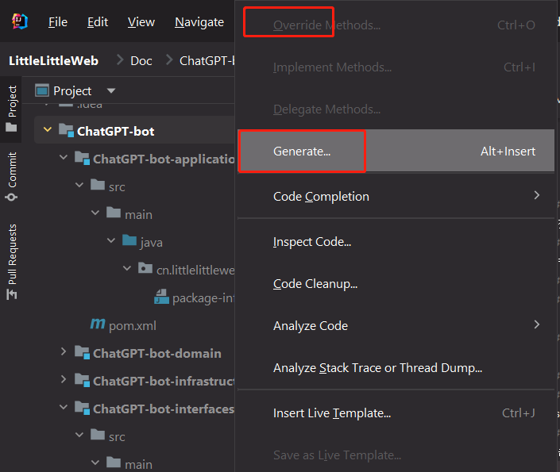
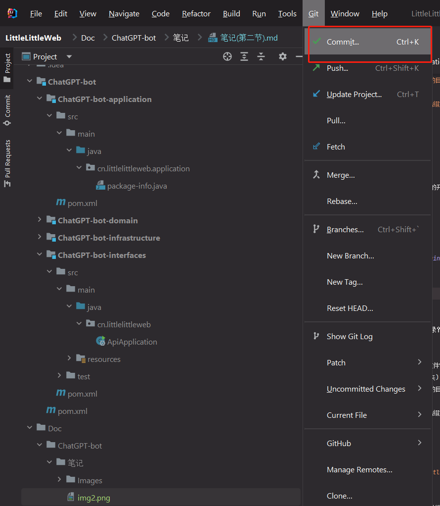

# 接口信息爬取
- [Github分支管理](#Github分支管理)
	- [分支(branch)](#分支(branch))
	- [创建分支](#创建分支)
- [学习HTTP协议](#学习HTTP协议)
	- [语法格式](#语法格式)
	- [图片使用](#图片使用)

## Github分支管理
### 分支(branch)
两个人或者多个人进行同一个项目的开发时就需要每个人有一个或者多个自己的分支，项目内容改变后就push到自己的分支上，不会影响到别人的开发和main分支的内容，保证开发安全

### 创建分支
1. 点击右下角的分支  

2. 点击`New Branch from 'main'`来创建一个新的分支

3. 点击`Git -> Commit`来提交该分支项目内容到git仓库

4. 点击`Git -> Push`来提交该分支项目内容到github

## 学习HTTP协议
所有对网页内容的爬取，以及发送内容到网页，都需要使用GET/POST请求来进行，需要学习了解HTTP协议  

HTTP协议的请求body和结果都基于json  
可以下载chrome的json-handle插件来方便查看json